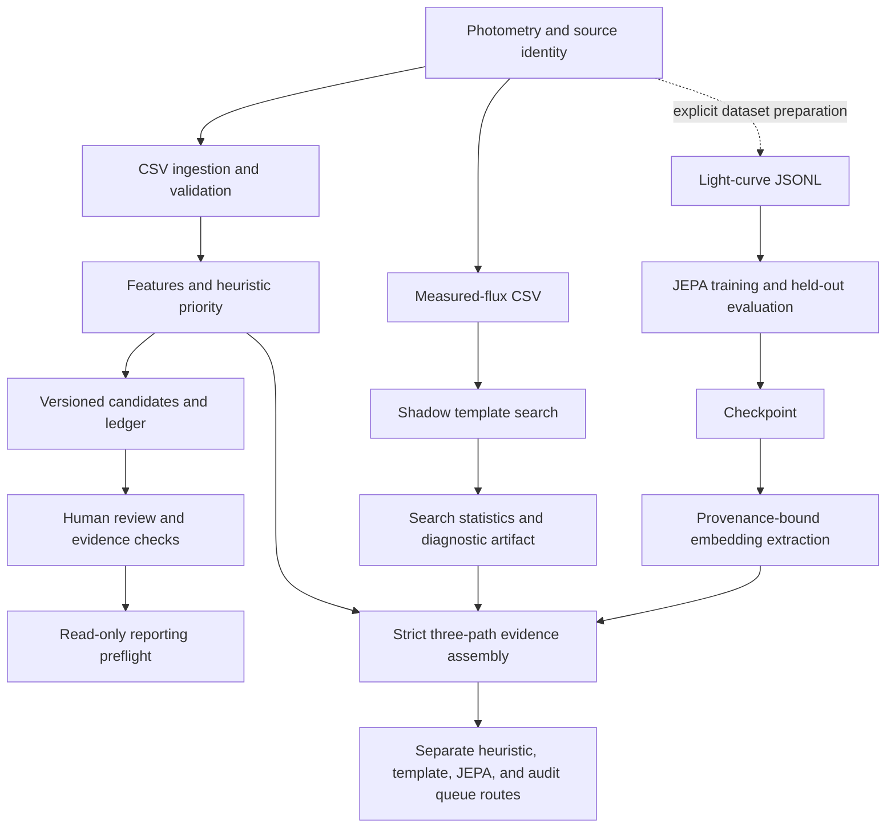

# How JEPA and transient detection fit together

[Main README and setup](README.md) · [Architecture reference](docs/ARCHITECTURE.md) · [Transient-search mathematics](docs/TRANSIENT_SEARCH.md)

SIDEREA helps an astronomer decide which changing sources deserve attention and
whether the evidence supports further action. A light curve is a sequence of
brightness measurements over time. A transient is a temporary astronomical event;
an unusual light curve can also come from a known variable, measurement error or
instrumental artifact.

**The three paths answer different questions.** The operational pipeline asks
which candidates deserve review and whether mandatory evidence is complete. The
statistical search asks whether measured flux departs from a constant background
under a stated noise model. JEPA learns a numerical representation of light-curve
structure that can support similarity search or downstream anomaly ranking.

## What is connected today



All shown arrows are implemented through explicit commands and immutable artifacts.
`analyze`, `transient-search`, and `jepa-embed` remain independent computations;
`shadow-assemble` verifies their physical identities and provenance before joining
them, and `shadow-rank` assigns separate review routes. There is deliberately no
fused JEPA/transient probability or production reporting shortcut.

## 1. Operational triage: interpretable evidence

`python -m siderea analyze` normalizes local photometry, computes survey/passband-aware
features, applies a decomposed heuristic priority, and writes an immutable run plus
ledger records. It preserves missing information rather than treating it as zero.
Observation identities prevent replayed measurements from inflating evidence.

Candidates can then be inspected in the local review UI. Catalogue checks,
reason-coded decisions and reporting preflight are separate evidence operations;
running local analysis does not perform every live check automatically. Missing,
failed, stale or mismatched mandatory evidence prevents reporting readiness.
A high priority score is not a probability of discovery.

## 2. Statistical transient search: test explicit shapes

`python -m siderea transient-search` accepts measured, potentially signed flux and
positive uncertainties. It fits a constant background and a nonnegative transient
amplitude across a bank of Gaussian, exponential, Bazin-like and fallback-like
shapes, searching over timing and width. These are phenomenological templates,
not a physical classification of an event.

The maximum bank statistic is compared with independently simulated null curves.
The plus-one Monte Carlo rank includes the bank search; channels receive a
within-object correction. It does not establish survey-wide or repeated-look
false-alarm control. Known covariance can be supplied through the API; the CLI's
optional covariance model must be justified independently.

The output records fitted shape, significance, p-value resolution, influence and
noise assumptions. The p-value is not the probability that a source is a real
transient. Correlated noise, underestimated errors and outliers caused substantial
false alarms in archived stress experiments; the paper retains those failures.

## 3. JEPA: learn structure without assigning a class

JEPA means **Joint Embedding Predictive Architecture**. SIDEREA's time-series
implementation predicts hidden representations rather than directly predicting a
supernova label or reconstructing a brightness curve.

1. A JSONL record supplies one curve's times, values, errors, bands and detection
   flags. Tokens contain time offset, normalized value/error, band identity,
   detection status and value-presence status.
2. Training masks a contiguous temporal region. Context normalization is recomputed
   from visible observations so hidden brightness values do not determine it.
3. The online/context encoder processes masked content. Timing and band information
   remain available; the predictor produces representations at target locations.
4. A target encoder processes the unmasked content under the same normalization.
   Its representations are layer-normalized and detached from gradient updates.
5. Smooth-L1 loss compares predicted and target representations at masked positions.
   Target parameters track the online encoder by exponential moving average:
   `target ← momentum × target + (1 − momentum) × online`.
6. Held-out evaluation repeats masks and reports losses and collapse diagnostics.
   `extract_embeddings` mean-pools valid online representations into one vector
   per curve for downstream Python use.

Training and validation IDs/groups must be disjoint. The default CLI split requires
all training observations to precede all validation observations. Token contracts,
dataset hashes, seeds and checkpoint metadata preserve the declared experiment.
The default JEPA band vocabulary is survey-agnostic: it must not be interpreted as
proof that different surveys' similarly named filters or calibrations are equivalent.

A low JEPA validation loss shows success on its representation-prediction task.
It does not by itself show useful astronomical discrimination, calibrated anomaly
probabilities or superiority over simple baselines.

## How they can help one another

| Evidence | Useful interpretation | What it cannot establish |
|---|---|---|
| Strong template fit | A declared temporal shape exceeds the simulated null threshold | Physical origin or correct real-sky noise assumptions |
| Unusual JEPA representation | A downstream reference comparison may flag unfamiliar morphology | That unfamiliarity is a transient rather than an artifact |
| Similar JEPA representations | Potential analogues for human inspection | A shared physical class without independent labels |
| Both appear interesting | A candidate worth comparing with supporting evidence | Permission to bypass catalogue or human-review gates |
| They disagree | A useful case for examining noise, coverage and model limits | Which model is correct without further evidence |

The repository has `RobustAnomalyDetector` and `EmbeddingIndex` primitives, plus a
finite-budget queue with an anomaly reserve. They are building blocks. The default
pipeline does not automatically fit them to JEPA embeddings. Review-set assembly
requires anomaly scores to agree with bound candidate evidence; appending a score
to a ranking file alone is insufficient.

A defensible combined experiment uses the same eligible population and observation
cutoff for all methods, fits representation/downstream models on permitted training
data, freezes transformations and checkpoints, then compares useful outcomes at the
same review budget on independently labelled later data. Keep the statistical and
learned evidence separately inspectable. Do not multiply a p-value and an anomaly
score into an invented discovery probability.

## Runnable setup and quickstart

From the repository root, with Python 3.11 or newer:

```bash
uv venv --python 3.11 .venv
uv pip install --python .venv/bin/python -e '.[ml,visualization,dev]'
.venv/bin/python -m siderea doctor
```

This installs the local model/plot/development dependencies. Use `.[all,dev]` instead
if live astronomy adapters are also needed. No credentials are needed for the
examples below. Optional astronomy warnings from `doctor` are expected without
that extra. All output paths must be new; choose another suffix when rerunning.

### A. Analyze and inspect candidates

```bash
python -m siderea analyze examples/photometry.csv --output-dir runs/quickstart-analysis --ledger runs/quickstart.sqlite
python -m siderea review-serve --ledger runs/quickstart.sqlite
```

Open the loopback URL printed by the server. Stop it with Ctrl-C before continuing
in the same terminal. The fixture produces two candidates with missing external
evidence: zero reportable candidates is expected. Typed local names are audit
labels, not hosted authenticated identities.

### B. Run the shadow transient detector

```bash
python -m siderea transient-search examples/transient_flux.csv runs/quickstart-shadow.json --null-trials 999 --seed 20260908
```

The fixture contains one synthetic pulse and one synthetic constant source. Read
`status`, `object_pvalue`, `threshold_resolvable` and `shadow_excess`; unevaluated
is not negative. This command does not update the operational ledger.

### C. Train a small JEPA model on CPU

```bash
.venv/bin/siderea jepa-train examples/jepa_train.jsonl examples/jepa_validation.jsonl runs/quickstart-jepa --config configs/jepa-smoke.toml --require-prediction-cutoffs --epochs 1 --batch-size 2 --evaluation-masks 2 --device cpu
```

Inspect `runs/quickstart-jepa/training.json` and `checkpoint.pt`. This small profile
uses width 32, one encoder layer and four attention heads. The larger
`configs/jepa.toml` profile is available for separately designed experiments.
The supplied JSONL curves are tiny synthetic fixtures, separate from the CSV
examples; these commands exercise complementary paths, not a fused-data benchmark.

`pilot-prepare` now creates cutoff-bound detector CSV and JEPA JSONL views from one
measured-flux table. `jepa-embed` extracts representations with checkpoint,
dataset, token-contract and code digests. `siderea.similarity.EmbeddingIndex`
requires the same provenance discipline for persisted indexes. These commands do
not fetch survey photometry, infer source aliases, or turn an anomaly score into a
discovery probability. Only load checkpoints from trusted sources.

For a strict point-in-time pilot that prepares both data views, extracts bound
embeddings and assembles separate detector/JEPA evidence, follow
[the cutoff-bound pilot runbook](docs/PILOT_RUN.md).

### D. Extract representations from the checkpoint

After the JEPA command above, extract the validation representations from the
repository root:

```bash
.venv/bin/siderea jepa-embed runs/quickstart-jepa/checkpoint.pt \
  examples/jepa_validation.jsonl runs/quickstart-jepa/validation-embeddings.json \
  --batch-size 2 --device cpu
```

The smoke profile produces a 32-dimensional vector per validation curve. The
output binds physical entity IDs, cutoff, input snapshot, checkpoint and code
identity. This performs actual inference but does not add scores to the candidate
ledger.

### E. Validate the checkout and reproduce paper results

```bash
make check PYTHON=python
make paper-check PYTHON=python
make paper-reconstruct PYTHON=python PAPER_OUTPUT=/absolute/path/to/new-reconstruction
python -m build
```

The reconstruction reruns historical numerical summaries and synthetic studies;
it does not recreate unavailable historical raw observations or qualify live data.
For live read-only TNS testing, follow [the qualification guide](docs/TNS_TESTING.md).

## Repository responsibilities

| Location | Responsibility |
|---|---|
| `src/siderea/ingest/`, `features/`, `scoring/`, `pipeline.py` | Operational photometry-to-candidate path |
| `src/siderea/research/transients.py` | Statistical shadow detector |
| `src/siderea/ml/dataset.py` | JEPA token contract and batching |
| `src/siderea/ml/jepa.py`, `train.py`, `evaluate.py` | Model, training, checkpoints, evaluation and embeddings |
| `src/siderea/anomaly.py`, `similarity.py`, `ranking.py` | Downstream research and finite-budget selection primitives |
| `src/siderea/validation/`, `review/`, `reporting/`, `ledger.py` | Evidence checks, exact-version review and preflight |
| `configs/`, `examples/` | Profiles and explicitly synthetic runnable fixtures |
| `tests/` | Executable behavior and safety regressions |
| `paper/` | Manuscript, frozen experiment artifacts and verification records |
| `runs/`, `var/`, `.test-tmp/` | Local outputs/environments; not alternate source trees |
| Root legacy scripts and `cool-stuff-master/` | Historical provenance; not the canonical implementation |

Do not mix legacy script outputs with new pipeline artifacts without an explicit
schema adapter. See [migration](docs/MIGRATION.md). Outstanding scientific and
engineering work remains explicit in [the checklist](PROJECT_FINISH_CHECKLIST.md).
## Transient-scale masking upgrade

The research configuration now sets `jepa.mask_scale_jitter = 0.50`. For every
curve, the seeded mask sampler selects one contiguous interval at 0.5x, 1x, or
1.5x the base mask fraction. This keeps the no-target-leakage contract while
training against brief excursions and slower light-curve evolution. The choice
is stored in training metadata, and evaluation repeats the identical declared
policy. It is a testable architectural hypothesis, not evidence of improved
astronomical performance; multi-seed ablations must compare zero and nonzero
jitter on the frozen prospective splits.
