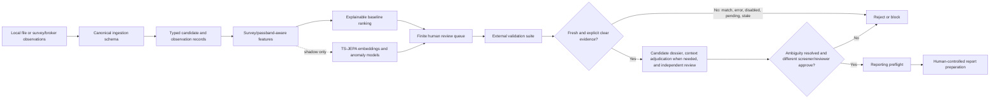
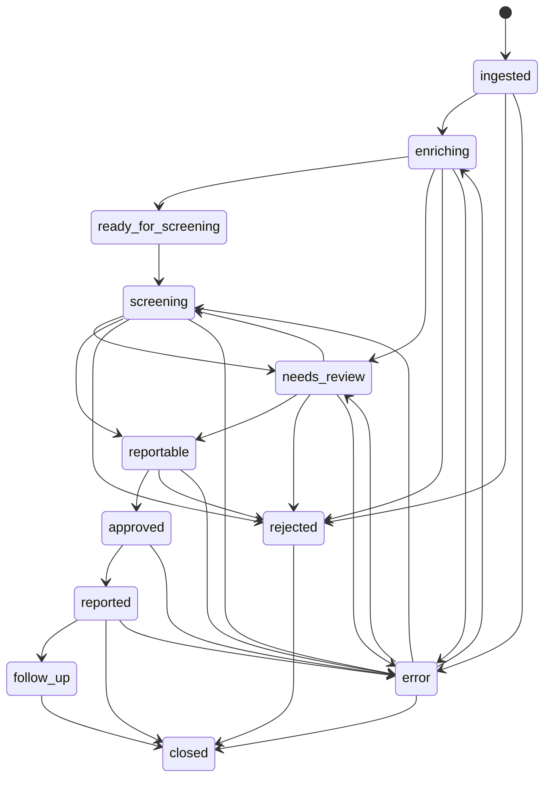

# SIDEREA architecture

## Purpose

SIDEREA separates candidate discovery, scientific evidence, human decisions, and
external reporting. The architecture is designed so a useful ranking model can
fail without turning a candidate into a false discovery claim.

This document describes code that exists under `src/siderea/`. A component being
implemented does not mean it has been validated on a representative live stream;
that evidence is defined in [`SCIENTIFIC_VALIDATION.md`](SCIENTIFIC_VALIDATION.md).

## System boundary

The dashed JEPA path is deliberately non-authoritative. It can affect which
candidate a person sees first only after it has passed the relevant validation
stage; it cannot provide catalogue clearance or human approval.

## Component map

| Component | Module | Current responsibility |
|---|---|---|
| Configuration | `siderea.config` | Load strict TOML, reject unknown keys, validate safety invariants, resolve paths |
| Command layer | `siderea.cli` | Expose local analysis, bounded broker fetch, verification, queueing/review-set assembly, dossiers, exact-version reviews/adjudications/outcomes, read-only reporting preflight, baseline, and JEPA commands |
| Domain model | `siderea.domain` | Immutable candidates, observations, evidence, and lifecycle states |
| State policy | `siderea.state` | Allowed transitions and fresh-evidence reportability checks for domain records |
| Ingestion contract | `siderea.ingest.base`, `siderea.ingest.schema` | Canonical photometry table, broker protocol, aliases, validation, deterministic ordering |
| Local ingestion | `siderea.ingest.csv` | Parse and hash one byte snapshot, preserve string identifiers, normalize JD/MJD and common schemas, and validate content-bound broker sidecars |
| Broker adapter | `siderea.ingest.alerce` | Lazily query bounded ALeRCE candidates plus detections/non-detections through the common contract with an explicit `ztf`/`lsst` namespace on every request; the CLI emits a digest-bound snapshot sidecar |
| Local orchestration | `siderea.pipeline` | Emit immutable `siderea.local_analysis.v4` runs with normalized data, v4 features, v2 rankings, evidence, snapshot, terminal manifest, ledger state, and a separate scientific fingerprint |
| Photometry | `siderea.features.photometry` | Emit `siderea.photometry.v4` features inside survey/passband channels from magnitudes and supplied forced/difference flux, including survey/uncertainty missingness and separate band/channel prior non-detection counts |
| Baseline score | `siderea.scoring.heuristic` | Emit `siderea.heuristic_priority.v2`, a bounded relative priority with visible inputs, basis selection, components, and warnings |
| Supervised baseline | `siderea.ml.baseline` | Fit a logistic baseline on an early time block, optionally calibrate on a later block, evaluate on the latest block, and require entity purging or an explicit unique-entity assertion |
| Service execution | `siderea.clients.base` | Retry remote operations and preserve error/match/clear provenance |
| Catalogue adapters | `siderea.clients.catalogs` | Lazy SkyBoT, SIMBAD, and VSX searches |
| TNS search | `siderea.clients.tns` | Read-only two-stage duplicate search by internal name and sky cone; aggregate both responses and reject malformed successful response shapes |
| Catalogue policy | `siderea.validation.catalog_policy` | Treat known stellar/variable counterparts as vetoes; route ambiguous host context to review |
| Evidence binding | `siderea.validation.binding` | Bind completed clearance to candidate identity/position, radius, every required SkyBoT epoch, and TTL policy; hash the exact preflight inputs |
| External gate | `siderea.validation.gates` | Require fresh, auditable clearance from every mandatory service after orchestration applies binding |
| Verification coordinator | `siderea.validation.suite` | Run configured checks, aggregate all required SkyBoT epochs, attach expiries, bind results to the request, and return a structured gate decision |
| Review/outcomes | `siderea.ledger` | Maintain the current candidate view plus append-only first-seen version snapshots and exact-version reviews, catalogue-context adjudications, and downstream outcomes in SQLite |
| Reporting preflight | `siderea.reporting.preflight` | Rebind and hash-check reviewed evidence, verify the published run/candidate artifact, then require independent approval of the current candidate version; exposed read-only as `siderea preflight` |
| Dossier | `siderea.review.dossier` | Write portable JSON and HTML evidence views for one candidate |
| Review-set assembly | `siderea.review.assembly` | Atomically bind exact ranking/candidate snapshots to a finite queue, selected dossiers, and an `siderea.review_set.v1` manifest containing artifact hashes |
| Local review UI | `siderea.review.server` | Serve a loopback candidate queue and append exact-version reason-coded review/adjudication events; no report/follow-up endpoint |
| Reproducibility | `siderea.manifest`, `siderea.data.snapshot` | Hash artifacts and datasets; record config, Git state when available, checkout or installed-package code digest, runtime, labels, split policy, and terminal interruption state |
| Evaluation | `siderea.evaluation` | Chronological splits and finite-budget ranking/calibration metrics |
| Review queue | `siderea.ranking` | Allocate reproducible finite capacity with explicit, de-duplicated priority, anomaly, and seeded random-audit routes plus audit propensity |
| Host association | `siderea.host` | Rank possible hosts by geometry and Poisson chance coincidence; withhold ambiguous associations |
| Representation learning | `siderea.ml.*` | Tokenize irregular light curves under a hashed per-curve contract, reject incompatible batches, train/evaluate TS-JEPA, checkpoint, and extract embeddings |
| Retrieval/anomaly | `siderea.similarity`, `siderea.anomaly` | Deterministically tied cosine retrieval with provenance-required persisted indexes, plus robust anomaly scores and optional Isolation Forest |
| Follow-up | `siderea.followup` | Combine reality, novelty, value, urgency, observability, information gain, and anomaly route |
| Advisory campaign sketches | `siderea.campaigns` | Suggest research targets, review budgets, and services without activating or overriding operational TOML policy |

The package now includes strict local ingestion and immutable local analysis with
a deterministic scientific-input fingerprint, plus CLI entry points, atomic
review-set assembly, and a bounded lazy ALeRCE adapter. It can extract features
from forced/difference-flux columns already supplied by an input source. Durable
live polling/replay, cutout or forced-photometry acquisition, independent
calibration qualification, a
production review service, and automated report transport remain outside the
completed boundary.

`general.campaign` is currently a versioned label carried through operational
artifacts; the actual enforced settings come from the selected TOML sections.
`siderea.campaigns` contains advisory experiment-design sketches only. Calling
`get_campaign()` does not activate a profile, change a threshold, or add a
mandatory service, including recommendations for integrations that do not yet
exist. This deliberate boundary prevents planning metadata from masquerading as
enforced scientific policy.

## Core invariants

### 1. A missing measurement is not a zero

Undefined photometric quantities remain `None` or missing. Feature warnings and
missingness fractions are output alongside values so a downstream model cannot
silently interpret absent evidence as a physical measurement.

### 2. Measurements remain survey-, filter-, and representation-aware

Magnitudes in different passbands have different effective wavelengths and may
have different zero points, and two surveys can use the same passband name with
different instruments/calibration. `siderea.photometry.v4` therefore computes
summaries inside a survey/passband channel whenever the input carries survey
identity. A missing survey value becomes an explicit `unspecified` channel and is
reported in `survey_missing_fraction`; it is not pooled with a named survey.
Inputs without any survey column retain passband-only channels for compatibility.
The output exposes both the physical `bands` inventory and the actual `channels`
used for feature records.
Forced/difference flux summaries are likewise channel-local and are not pooled
with magnitude values. Cross-channel aggregation is restricted to comparable
quantities such as counts, within-channel differences, normalized rates, and
significances. Prior non-detections are paired only inside the same channel.

Numeric filters use ZTF/ALeRCE `fid` aliases only when no survey column is present
or when the normalized survey is explicitly configured as ZTF/ALeRCE. Other
surveys keep their numeric filter labels, preventing an implicit cross-survey
translation.

For a supplied flux series, `fractional_flux_excursion` divides a within-channel
peak contrast by a robust data-derived scale. This makes it invariant to a change of
flux units; it is **not** a physical flux ratio, calibrated magnitude, or proof
that the upstream subtraction is valid. Raw flux values remain in normalized
photometry and their per-channel feature records rather than being aggregated
across channels. The extractor does not acquire images, perform forced photometry,
determine zero points, or certify upstream calibration.

### 3. Priority is not probability

The v2 heuristic combines amplitude, significance, temporal shape, prior
non-detection, sampling, and quality into an inspectable index in `[0, 1]`. It
prefers magnitude amplitude and temporal evidence when those values exist, and
uses the supplied forced-flux path explicitly as a fallback when they do not.
Significance and same-channel prior contrast can use either measurement path. Each
component retains its inputs and applicable basis. The numeric range does not make
it calibrated and the value must not be labelled confidence, probability-real,
or discovery probability.

Any later supervised probability must have a versioned training snapshot,
object-level chronological split, calibration evaluation, and an explicit domain
of validity.

### 4. Remote failures close the gate

External results use distinct states:

| State | Meaning | Gate effect |
|---|---|---|
| `clear` | Query completed and produced no vetoing match | May satisfy one mandatory check while fresh |
| `match` | Query completed and found a known counterpart | Reject as known object under the current policy |
| `error` | Query or response processing failed | Block |
| `disabled` | Client intentionally did not run | Block |
| `pending` | Result not yet available | Block |
| `stale` or expired | Result is outside its validity window | Block and re-run |
| missing | No record exists | Block |

Retries use bounded exponential backoff with jitter. Exhausted retries preserve
the error; they never return an empty catalogue as if the query succeeded. A
claimed clearance must record at least one attempt and a response digest, contain
neither matches nor an error, and stay within the configured TTL. Cone-search
clearance is checked against the candidate sky position and minimum service radius;
TNS clearance also requires the candidate identity. SkyBoT runs once for every
distinct reference MJD supplied to verification and returns one aggregate record
whose query declares `coverage_policy = all_distinct_detection_epochs`. Each
component is bound to its requested MJD, and the aggregate can be clear only when
all components are clear. A match at any epoch takes conservative precedence;
error, disabled, stale, or pending evidence at any epoch blocks. When imported by
the pipeline, the aggregate must cover every distinct usable detection MJD in the
normalized candidate data. Invalid clearance is downgraded to `error`; positive
`match` evidence remains a conservative veto.

Verification imports require the top-level `siderea.verification.v1` schema, a valid
candidate ID and checks array, and a boolean `manual_review_required`. Every
imported check must provide the complete exact provenance shape; missing or
unknown fields are rejected rather than having timestamps, attempts, or versions
synthesized during import.

The TNS adapter additionally validates its application-level success code and
accepted result-array shapes. A missing result array, a differently shaped payload,
or a non-object result row becomes failed evidence rather than a successful empty
search. Duplicate clearance requires both the internal-name and position-cone
subchecks; their attempts and response digests are combined into one bound record.
The binding layer accepts imported TNS `clear` evidence only when it declares
`tns-two-stage-search.v1`, the ordered `internal_name` then `cone` methods, the
`internal_name_and_position_cone` coverage policy, and matching candidate/internal
identity. A generic or legacy cone-only clearance cannot open the gate.

### 5. Models cannot override vetoes

The external-evidence and quality gates are independent of ranking. A high
heuristic, anomaly, classifier, or JEPA score cannot convert a match, error, or
stale check into clearance.

### 6. Ambiguity is routed, not erased

SIMBAD variable and stellar counterparts are vetoes. Galaxy/AGN/unknown
counterparts are retained as context and force manual association review instead
of being automatically called either a host or a contaminant.

The geometric host utility orders candidates by chance-coincidence statistic,
normalized offset, angular separation, then a case-stable identifier. The final
identifier key makes output reproducible; it does not resolve a scientific tie.
Automatic acceptance requires explicit positive positional uncertainty for the
transient and every supplied host, a chance statistic at or below the configured
threshold, and a runner-up/best contrast at or above the configured threshold.
Missing or zero uncertainty and exact/insufficiently separated ties remain
ambiguous for review.

### 7. Review has separation of duties

The current SQLite ledger records reviews with either a `screener` or `reviewer`
role. Every review is append-only and names an explicitly supplied exact current
immutable candidate version; neither the ledger write API nor the CLI infers that
version, and stale values are rejected. Reporting preflight requires a screener
plus the configured number of reviewer approvals and
requires at least one reviewer to differ from the screener. Only each person/role
pair's latest decision for that exact version is active, and an active rejection
blocks approval. A change to normalized observations, features, score, checks,
quality/gate state, or relevant scientific policy creates a different version, so
old approvals do not count. Human approvals cannot waive missing evidence.

Ledger schema v4 preserves the first snapshot observed for every
`(candidate_id, version_digest)` in an append-only history table while retaining a
separate mutable current-candidate view for workflow refreshes. Public lookup APIs
can reconstruct one historical version or list them in first-seen order. Database
triggers prohibit update/deletion of archived snapshots and reject new or changed
review, adjudication, or outcome references to a version absent from that history.
The normal write APIs remain stricter: a new decision/outcome must target the
candidate's exact current version. Repeating a workflow update under the same
scientific version does not rewrite its first-seen archived evidence.

Preflight reconstructs the evidence-binding context from the ledger payload,
revalidates completed checks, and compares a stable digest over the full bound
checks, quality/manual flags, mandatory-service set, and binding policy with the
digest stored in the reviewed payload. Missing context or any mismatch blocks
before approval is considered.

The ledger separately records reason-coded catalogue-context adjudications with
the exact current candidate version. When `manual_review_required` is true,
preflight accepts the context as resolved only if at least one adjudicator's latest
decision is `clear_context` and no adjudicator's latest decision is `reject`. With
no active clearance, an absent decision or `needs_more_data` remains unresolved.
The adjudication does not mutate the immutable scientific version and cannot
override a known-object match, failed quality, incomplete external evidence, or
the independent-review requirement. Changing the candidate version makes prior
adjudications inapplicable, just as it does reviews. A subsequent identical
analysis run materializes the resolved workflow state in its candidate artifacts.

Downstream outcomes are also append-only and must name the exact current candidate
version. Each record carries a taxonomy version and a SHA-256 of its optional
evidence object. This prevents an outcome from being silently attached after the
candidate evidence changes; it does not make the outcome label scientifically
correct without the stated external evidence.

The local review server binds to loopback by default, rejects non-loopback or
wrong-port `Host` headers before rendering a page or disclosing its per-process
CSRF token, requires an exact non-duplicated form schema, bounds form size, and
has no report or follow-up endpoint. These controls reduce browser-origin and
DNS-rebinding exposure; they do not authenticate a person or defend against an
already-compromised local account. A typed reviewer name is an audit label, not
proof of identity, and a multi-user deployment needs an authenticated gateway and
separate authorization review.

### 8. Review allocation is explicit and replayable

The nightly queue has three non-overlapping routes: seeded random audit, primary
priority, and an anomaly reserve with unused capacity flowing back to priority.
Audit selection uses a platform-independent SHA-256 ordering over the complete
eligible population. `siderea.nightly_queue.v2` records the seed, population,
requested/used audit slots, uniform without-replacement inclusion probability,
selection policy, and per-audit-entry propensity. The CLI generates and records a
seed when audit slots are requested without one; a library caller must supply it.
Propensity applies only to the randomized route.

Queue eligibility is named rather than implicit. `triage` admits quality-passing
candidates whose external evidence is incomplete while excluding known-object and
quality vetoes. `gate-clear` admits only an automated `reportable` decision or a
candidate routed to catalogue-context adjudication. Unknown gate states fail
closed under either policy.

`review-set` reads each input once, requires `siderea.candidates.v1`, verifies exact
candidate-ID and candidate-version agreement between the ranking and evidence,
and atomically creates a new directory. `siderea.review_set.v1` contains the queue,
input hashes, selected versions, artifact inventory, exact input snapshots, and
one dossier per selection. It refuses overwrite and explicitly states that the
bundle is triage support, not reporting authorization.

### 9. External reporting remains human-controlled

The new TNS adapter can search for duplicates but cannot submit reports. Dossiers
and preflight results are decision-support artifacts. Any report transport must be
an explicit, separately reviewed integration and must not silently downgrade the
preflight contract.

## Candidate lifecycle

The domain state machine prevents arbitrary jumps while allowing errors to be
recovered through a defined stage:

State names are workflow metadata, not scientific classifications. A candidate in
`reportable` has passed configured evidence gates; it is not thereby a confirmed
supernova or a discovery.

## Data and provenance contracts

### Observations

An observation includes time, band, detection status, optional magnitude/flux and
their uncertainties, optional limiting magnitude, survey, identifier, and quality
flags. Detections require a magnitude or flux. Non-detections require forced flux
or a limiting magnitude. An input with no finite magnitudes—including a present
but entirely empty magnitude column—must declare a non-missing detection status for
every row; the sign of difference flux is not used to infer detection. Exact
duplicate observations and reuse of a non-empty observation ID within the same
source/survey are rejected so repetition or conflicting revisions cannot inflate
the detection count. Survey-specific revision/version semantics and near-duplicate
policy still require qualification. Times and coordinates are validated. The
canonical names are `flux` and `flux_error`, with documented common aliases
resolved during ingestion.

The local quality gate fails when all detection uncertainties are missing or
invalid. Partial uncertainty missingness stays explicit and penalizes the heuristic
quality component, but does not alone fail the local gate. This is not image-level
quality validation or a calibrated survey significance policy.

### External checks

Check provenance records the service, public query parameters, timestamp,
expiration, match identifiers, error, attempts, latency, response digest, and
service-version string (possibly empty for a service with no versioned contract).
Secrets must not appear in public query metadata or run
artifacts. Clearance is usable only after the binding layer verifies that this
provenance describes the same candidate, coordinates, cone policy, and all
relevant SkyBoT epochs used by the gate. The pipeline stores both an immutable
candidate-version digest and a narrower preflight digest so reporting cannot
substitute fresh but different evidence after reviewers approve.

### Runs and datasets

`RunManifest` can record:

- the command and effective configuration;
- a stable configuration digest;
- Git revision and dirty state when available, plus a SHA-256 over checkout
  `src/siderea`, `configs`, and `pyproject.toml` contents; when those paths are absent,
  the digest falls back to the actual installed `siderea` package tree and refuses
  to emit an empty code identity;
- Python, platform, and selected dependency versions;
- output artifact paths, sizes, roles, and SHA-256 digests;
- external-check provenance, warnings, and metrics; and
- an explicit terminal state: completed, failed, blocked, or interrupted.

`DatasetSnapshot` hashes every input file and records the label and split policy.
Once its run directory exists, the local analysis pipeline closes its manifest on
normal success, caught processing failure, or `KeyboardInterrupt`. Failure/interruption
manifests best-effort register every already-finalized partial artifact before the
terminal manifest is written. For a direct local CSV, the source is hashed in
ingestion provenance and the exact already-parsed bytes are archived as a
`source-input-snapshot` artifact. The pipeline does not reopen the mutable source
path to create that artifact.
`broker-fetch` instead emits an adjacent `siderea.broker_snapshot.v1` sidecar whose
photometry SHA-256 is verified before ingestion; its broker query/source/retrieval
metadata and sidecar/photometry digests are retained in the run's ingestion
provenance. ALeRCE requests always carry an explicit survey. ZTF uses the legacy
`ndet` filter; the qualified Rubin/LSST profile uses the multi-survey `n_det`
contract and binds the returned class, classifier name, classifier version, and
minimum-detection count before accepting an object. Rubin `band_name`, `psfFlux`,
and `psfFluxErr` fields are mapped explicitly rather than treated as ZTF `fid`
semantics. Every future production orchestration entry point must preserve that
behavior; commands other than local analysis still need equivalent terminal-run
coverage where they become production orchestration boundaries.

### Persisted similarity indexes

The in-memory cosine index accepts provenance as caller-supplied metadata. Saving
an index is stricter: `siderea.embedding_index.v2` requires 64-hex SHA-256 identifiers
for the encoder, token contract, and dataset snapshot, and loading rejects legacy,
malformed, or incomplete provenance. A provenance-bearing index refuses queries
without matching encoder and token-contract digests. Equal similarity scores use
a stable candidate-ID tie-break. These digests bind the persisted matrix to declared
artifacts; they do not authenticate the producer or prove that the dataset or
encoder is scientifically valid.

### Supervised baseline identity policy

The baseline CLI cannot train without an explicit physical-entity policy. Normal
use supplies `--entity COLUMN`, allowing rows from a repeated entity to be purged
across time-blocked train/calibration/test boundaries. The alternative
`--assert-unique-entities` records the caller's assertion that every row is a
different physical entity; SIDEREA cannot verify that claim. Model metadata includes
the entity policy, whether purging occurred, a dataset digest that covers entity
IDs, and the exact split digest.

## TS-JEPA boundary

The JEPA token schema is:

1. time since the previous retained observation;
2. robustly normalized value;
3. normalized uncertainty;
4. stable band identifier;
5. detection indicator; and
6. value-present indicator.

Each tokenized curve records a canonical `siderea.light_curve_tokens.v3` contract
and its SHA-256. The contract covers these ordered fields, value kind/direction,
the complete band-to-ID vocabulary and unknown-band policy, missing-error
sentinel, maximum length/truncation, equal-time ordering, and normalization scope.
Collation recomputes each known contract digest and rejects a batch that mixes
different contracts, mixes known and missing provenance, or carries a mismatched
digest. An entirely legacy batch with no contract metadata is still accepted for
compatibility, but it has no contract provenance and must not be represented as a
v3-provenanced batch.

Training, repeated-mask evaluation, and embedding extraction observe the verified
digest across the entire run, reject a transition between contracts or between
provenanced/unprovenanced batches, and return the observed digest in their result.
The `jepa-train` CLI requires train and validation dataset contracts to match,
checks that both runtime results report that same digest, and stores the full
contract plus digest in checkpoint metadata and the training summary.

Tokens are sorted by time and padded with an explicit boolean mask. Supplied
uncertainties must be positive, so normalized uncertainty `0` is reserved as an
explicit missing-error sentinel rather than filled from other epochs. Tokenization
first applies robust per-curve scaling for numerical stability. During each masked
example, values and uncertainties are then re-based from unmasked context only
(detected context when available, otherwise measured context), preventing the hidden
target values from selecting the visible context normalization. The value-present
indicator keeps a finite zero/non-detection distinct from a missing measurement and
lets absent context values remain neutral after rebasing.

The JSONL loader requires object IDs and aligned time/value/error/band arrays.
Because `value_kind` defaults to flux, flux records require an explicit detection
array; only magnitude records may infer detections from finite values. Train and
validation object IDs, and their optional `entity_id`/`group_id` aliases, must be
disjoint. The default `chronological` split additionally requires every training
observation to precede every validation observation. `predefined` is an explicit
caller assertion that an external split was audited, not an automatic leakage
guarantee.

During training, one contiguous valid window is hidden from the context encoder
while its times and bands remain available. A predictor estimates the latent target
encoder output at those epochs. The target encoder is a non-gradient exponential
moving average of the context encoder. The objective is smooth L1 latent loss.

Implemented diagnostics include held-out masked loss over at least two seeded mask
repeats (five by CLI default), loss dispersion and a 95% half-width,
target-feature variance, collapsed-feature fraction, representation RMS, and
deterministic mask sampling for checkpoint comparison. Training seeds model,
loader, and mask sampling and asks PyTorch for deterministic algorithms by default;
an explicit CLI flag permits nondeterministic kernels. Those controls improve
repeatability but do not promise bit-identical results across all hardware stacks
or establish astronomical utility. The model remains in shadow mode until the
promotion gates in the scientific validation plan pass. It is neither a calibrated
probability model nor an input to reportability.

## Dependency and failure boundaries

- Core configuration and domain types use the Python standard library.
- NumPy and pandas power photometry and evaluation.
- Astropy, astroquery, and network access are imported only when catalogue clients
  execute. Their absence becomes explicit failed evidence.
- Scikit-learn is optional for Isolation Forest; the robust anomaly baseline works
  without it. It is also required for the chronological supervised baseline and
  its joblib model bundle.
- PyTorch is optional; JEPA functions raise a focused runtime error when absent.
- Matplotlib is an optional visualization extra; it is not required by the core
  local analysis pipeline.
- SQLite is local and embedded. Multi-user deployment, authentication, migrations,
  locking policy, backup, and audit-log hardening remain production work.
- Saved supervised baselines use executable joblib serialization. The loader
  verifies the recorded SHA-256 but also requires an explicit trusted-source flag;
  a matching hash proves integrity against the manifest, not that an unknown
  publisher is safe.

## Trust boundaries still to build

The following are not yet complete production services:

- authenticated, authorized multi-user reviewer deployment (the current UI is
  local-only research tooling);
- source-qualified object identity and explicit campaign membership for true
  multi-campaign operation (the local ledger currently treats `candidate_id` as
  globally unique and fails closed on a cross-campaign collision);
- durable broker polling/replay and upstream schema monitoring;
- alert cutout provenance and image-level artifact models;
- survey-side forced-photometry acquisition, calibration qualification, and
  upper-limit homogenization (feature extraction from supplied flux is already
  implemented);
- calibrated supervised probability models;
- model registry, approval, rollback, and drift monitoring;
- observatory scheduling and command dispatch;
- TNS submission transport; and
- continuously exercised backup and disaster recovery.

Until those boundaries are implemented and validated, operate SIDEREA as local
research decision support with independent human verification.
