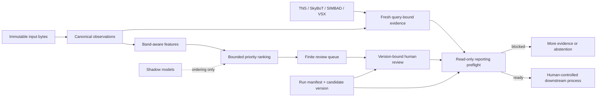

# PROJECT EXECUTION REPORT

Audit and execution date: **2026-09-06**  
Release boundary: **IRIS 0.2.0, maintained package under `src/iris/`**  
Authors and maintainers: **Aadi Ajeesh Nair** and **Ryan Gomez**

## 1. Executive Summary

IRIS is now a coherent, typed, packageable research platform rather than a set of
loosely coupled transient-search scripts. Its strongest design choice is also its
most important safety property: models allocate attention, while fresh bound
evidence and independent human decisions control reportability. The maintained
package has no unattended TNS reporting transport.

This execution cycle audited the code, configuration, test suite, local review
surface, packaging, CI, dependency graph, documentation, generated manuscript,
and research claims. It then implemented the highest-value corrections instead of
stopping at recommendations. The final tree passes 318 tests and 96 subtests on
Python 3.11, 3.13, and 3.14; strict typing across 54 source modules; formatting and
lint checks; byte compilation; 78% branch-aware coverage; two dependency audits;
fresh wheel/sdist builds; an isolated installed-wheel workflow; and an end-to-end
fail-closed review/preflight exercise.

No known P0 or P1 code defect remains inside the audited local-only boundary.
That is not a production-readiness or scientific-performance claim. Multi-user
identity, live-service qualification, durable broker operations, image-level
evidence, and a prospective frozen cohort remain promotion blockers.

## 2. Baseline Problems

Three evidence snapshots are kept separate:

| Snapshot | Tests | Subtests | Interpretation |
|---|---:|---:|---|
| Manuscript audit freeze | 212 | 54 | Historical paper evidence; intentionally immutable |
| Prior engineering audit record | 212 | 55 | Earlier repository-wide release audit |
| First measured baseline in this execution | 245 | 60 | Starting point for the final hardening pass |
| Final verified tree | 318 | 96 | Current engineering evidence |

The baseline had several concrete weaknesses:

- the loopback review service used CSRF but disclosed its page to arbitrary
  `Host` headers and accepted duplicated or unexpected form fields;
- an installed process could hash a lookalike `src/iris` directory in its current
  working tree rather than the package it had actually imported;
- direct dataclass/client construction admitted Python booleans as integers or
  floats at scientific and network trust boundaries;
- TNS transport accepted caller-supplied non-HTTPS endpoints, and several service
  response/type edge cases were not sufficiently adversarially tested;
- strict mypy configuration existed but initially exposed 12 real typing defects;
- CI lacked a dedicated vulnerability gate, automated dependency updates, current
  action pins, an sdist support-file assertion, and a complete supported-Python
  proof;
- the source distribution omitted security, contribution, architecture, and
  example material linked by the README;
- example ML commands did not state their actual column contract and could invite
  users to misread a perfect toy ranking as scientific performance;
- the previous wheel and audit counts no longer described the live source tree;
  and
- prospective scientific value, live catalogue behavior, authentication, image
  evidence, and scale performance remained unmeasured.

## 3. Work Completed

### 3.1 Review-service request boundary

**Problem.** A hostile web origin could target the loopback UI through DNS
rebinding, and ambiguous URL-encoded forms could contain repeated or unknown
fields.  
**Root cause.** Loopback socket binding and CSRF do not validate the HTTP authority
or remove parser ambiguity.  
**Implementation.** The server now validates loopback hostnames/IPs and the bound
port before rendering any page or exposing the token, closes rejected
connections with HTTP 421, requires an exact one-value form schema, retains the
64 KiB/16-field limits, and keeps restrictive browser headers.  
**Files.** `src/iris/review/server.py`, `tests/test_review_server.py`,
`docs/ARCHITECTURE.md`, `SECURITY.md`.  
**Verification.** Pure parser tests plus handler-level GET tests cover IPv4,
IPv6, `localhost`, wrong ports, userinfo, malformed values, hostile hosts,
duplicated fields, omitted fields, and unknown fields.  
**Impact.** Browser-origin and DNS-rebinding exposure is materially reduced. This
does not turn typed reviewer names into authenticated identities.

### 3.2 Code provenance and artifact publication

**Problem.** Installed code could attest to an unrelated source checkout in the
working directory. Several artifact paths also needed stronger atomicity and
binding guarantees.  
**Root cause.** Checkout discovery was based on location, not identity with the
active imported package.  
**Implementation.** Manifest creation hashes a checkout only when its
`src/iris` resolves to the imported package root; otherwise it hashes the actual
installed package. A shared writer creates unpredictable same-directory 0600
temporary files with exclusive/no-follow semantics, fsyncs content, and commits
with atomic replace or no-clobber hard links. Source bytes, broker CSV/sidecar
pairs, candidate records, review sets, similarity indexes, model bundles, and
terminal manifests use content binding and atomic/no-clobber publication at
their respective boundaries.  
**Files.** `src/iris/atomic.py`, `src/iris/manifest.py`, `src/iris/pipeline.py`, `src/iris/integrity.py`,
`src/iris/ingest/snapshot.py`, `src/iris/review/assembly.py`,
`src/iris/similarity.py`, `src/iris/ml/baseline.py`, tests for reproducibility,
atomic publication, pipeline failure paths, review assembly, similarity, and packaging.  
**Verification.** Symlink-target, injected-replace-failure, and no-overwrite tests;
a lookalike-checkout regression test; manifest fault injection; three complete
manifest hash replays; isolated-wheel analysis; and SQLite
integrity/foreign-key checks all passed.  
**Impact.** The recorded code digest now identifies the code used by the process,
and interrupted or mixed publications fail closed.

### 3.3 Configuration and public API validation

**Problem.** Python's `bool` subtype relationship with `int` allowed values such
as `True` to cross direct-constructor numeric boundaries even though TOML loading
was stricter.  
**Root cause.** Validation relied on range checks without first enforcing exact
semantic types.  
**Implementation.** General, hunt, validation, network, review, ranking, and JEPA
configuration objects now reject boolean numeric aliases, non-finite values,
invalid strings, unsafe user-agent line breaks, invalid schema versions, and
mutable-policy relaxations. TNS credentials, timeout, identity, coordinates, and
radius receive the same direct-API treatment.  
**Files.** `src/iris/config.py`, `src/iris/clients/tns.py`,
`tests/test_config_domain.py`, `tests/test_clients.py`.  
**Verification.** Adversarial constructor tests cover every corrected type path;
the final broker/pipeline/CLI hardening group passes 107 tests and 3 subtests.  
**Impact.** Library use now preserves the same scientific and network invariants
as CLI/TOML use.

### 3.4 Measurement, ingestion, and ranking correctness

**Problem.** Historical paths could pool incompatible filters/surveys, obscure
missing uncertainty and quality semantics, accept ambiguous input aliases, or
produce unstable ordering at ties.  
**Root cause.** Operational scripts conflated convenience representations with a
versioned measurement contract.  
**Implementation.** `iris.photometry.v4` preserves magnitude, limit, supplied
forced/difference flux, detection, uncertainty, quality, survey, and channel
missingness. Input bytes are read once; duplicate headers/observation identities,
conflicting aliases, malformed numeric data, and cross-survey ambiguity are
rejected. Ranking, campaign allocation, host ordering, and metric cutoffs have
deterministic terminal tie policies.  
**Files.** `src/iris/ingest/*`, `src/iris/features/photometry.py`,
`src/iris/bands.py`, `src/iris/scoring/heuristic.py`, `src/iris/ranking.py`,
`src/iris/campaigns.py`, `src/iris/host.py`, and their regression suites.  
**Verification.** Tests cover raw duplicate headers, one-column/multiple-field
aliasing, leading-zero IDs, malformed measurements, pairwise coordinate drift,
survey-aware filters, missing errors, non-finite inputs, tie invariance, and
host ambiguity.  
**Impact.** Scores remain interpretable priorities over explicit measurements;
they cannot silently acquire information from a different survey or missingness
state.

### 3.5 Broker contract qualification

**Problem.** ZTF and Rubin/LSST travel through different ALeRCE clients, filter
names, identifier types, classifier contracts, and photometry fields; treating
them as one implicit schema can silently change the selected population.  
**Root cause.** The upstream client is multi-survey at its public surface but
still routes ZTF through a legacy API and LSST through a newer API.  
**Implementation.** Every request carries an explicit survey. ZTF uses `ndet`;
LSST uses `n_det`, deterministic ranking parameters, a qualified default
classifier/version, and response-side validation of the class, classifier,
version, and minimum count. Rubin band names and PSF flux/error fields map
explicitly into the canonical measurement contract. Network calls inherit a
validated timeout, contact user agent, bounded retry count, and backoff policy.  
**Files.** `src/iris/ingest/alerce.py`, `src/iris/ingest/schema.py`,
`src/iris/cli.py`, `tests/test_core_trust_boundaries.py`, `tests/test_cli.py`.  
**Verification.** Contract fakes reject unknown parameters and mismatched or
missing response fields. A bounded live run through IRIS and `alerce` 2.3.0 on
2026-09-06 fetched one SN object and one z-band detection under
`stamp_classifier_rubin_beta` 2.0.1. The row carried the expected Rubin band/PSF
fields and was conservatively marked unusable because an upstream failure flag
was set.  
**Impact.** Survey drift now stops ingestion instead of changing the scientific
cohort invisibly. The spot check is not a recurring service qualification.

### 3.6 External evidence and reporting preflight

**Problem.** A nominally successful but malformed response, incomplete epoch
coverage, stale result, displaced service response, or downgraded policy could be
mistaken for valid clearance.  
**Root cause.** Service success, scientific query binding, and reporting
authorization were not consistently represented as separate contracts.  
**Implementation.** TNS uses validated HTTPS and requires internal-name plus cone
searches; SkyBoT binds every distinct usable detection epoch; SIMBAD/VSX context
is preserved; all clear evidence needs attempts, response digest, TTL, identity,
position/radius, and service-specific coverage. Reporting preflight reconstructs
and rechecks the bound evidence, terminal run publication, candidate version,
manual-context resolution, and independent approvals.  
**Files.** `src/iris/clients/*`, `src/iris/validation/*`,
`src/iris/evidence_context.py`, `src/iris/reporting/preflight.py`,
`src/iris/provenance.py`, and evidence/safety/client suites.  
**Verification.** Disabled network verification exited 3. After a screener and a
different reviewer both approved the exact version, preflight still exited 3 and
named all four pending services.  
**Impact.** Neither transport success, a model score, nor human approval can
launder missing scientific evidence into reportability.

### 3.7 Ledger and human-decision integrity

**Problem.** Mutable candidate projections and free-form identities could detach
decisions from the exact evidence a person reviewed.  
**Root cause.** Current workflow state and immutable scientific history were not
fully separated.  
**Implementation.** Ledger schema v4 retains an append-only first-seen payload for
every candidate version, normalizes principals, requires exact-current-version
writes, attaches taxonomy/evidence digests to outcomes, and uses database triggers
to reject unknown versions or modification/deletion of scientific events.  
**Files.** `src/iris/ledger.py`, `src/iris/domain.py`, `src/iris/state.py`,
`tests/test_ledger_versions.py`, `tests/test_safety_foundation.py`.  
**Verification.** Migration, stale-version, concurrent-change, trigger, history,
adjudication, outcome, and preflight tests pass; the final audit ledger returned
`ok` from `PRAGMA integrity_check` and no foreign-key violations.  
**Impact.** Review history is reconstructable and old approvals cannot authorize
changed evidence.

### 3.8 Learning-path discipline

**Problem.** Leakage, mixed token contracts, unrestricted checkpoint loading,
single-mask uncertainty, and degenerate anomaly reference sets could make model
outputs look more trustworthy than they were.  
**Root cause.** Research convenience paths lacked the same provenance and
abstention discipline as the core pipeline.  
**Implementation.** The supervised baseline uses chronological
train/calibration/test partitions plus required entity purging or an explicit
unique-entity assertion. It distinguishes ranking scores from calibrated
probabilities. TS-JEPA uses versioned irregular-time tokens, context-only
renormalization during masking, EMA targets, deterministic algorithms, repeated
masks, contract-bound checkpoints, restricted `weights_only` loading, and collapse
diagnostics. Anomaly and similarity paths validate support and provenance.  
**Files.** `src/iris/ml/*`, `src/iris/anomaly.py`, `src/iris/similarity.py`,
`src/iris/evaluation.py`, ML/ranking/similarity tests, and scientific-validation
documentation.  
**Verification.** The synthetic baseline smoke recorded an uncalibrated score
because its calibration block was too small. One CPU JEPA epoch completed with
matching token-contract digests, two deterministic mask repeats, and explicit
non-collapse diagnostics.  
**Impact.** Research outputs are reproducible and inspectable, but remain
non-authoritative and shadow-only.

### 3.9 Release engineering and documentation

**Problem.** The repository's release controls and onboarding material lagged the
actual platform.  
**Root cause.** Build, security, typing, dependency, and support-file checks were
not one enforced release graph.  
**Implementation.** CI now separates quality, Python 3.11/3.13/3.14 tests,
security, and packaging; uses least-privilege permissions and full-commit action
pins; runs branch coverage, strict mypy, dependency checks, isolated wheel smoke,
and sdist content checks; and blocks packaging on every prior job. Dependabot,
`SECURITY.md`, `CONTRIBUTING.md`, `MANIFEST.in`, typed-package metadata, author
metadata, reproducible example commands, and a release-oriented Makefile were
added or completed.  
**Files.** `.github/*`, `pyproject.toml`, `MANIFEST.in`, `Makefile`,
`requirements.txt`, `README.md`, `SECURITY.md`, `CONTRIBUTING.md`, `examples/README.md`.  
**Verification.** Workflow YAML parses, every third-party action is commit-pinned,
both dependency audits are clean, the fresh wheel exposes `default.toml` and
`py.typed`, metadata names both authors, and the installed dependency set passes
compatibility checks.  
**Impact.** A clean checkout has an explicit path from setup to a verified,
installable release artifact.

## 4. Bugs Fixed

1. Prevented lookalike working directories from contaminating installed-package
   source attestation.
2. Rejected DNS-rebinding, malformed, credential-bearing, non-loopback, and
   wrong-port review `Host` values before CSRF disclosure.
3. Rejected duplicated, missing, and unknown review/adjudication form fields.
4. Rejected booleans at scientific integer/float configuration boundaries.
5. Rejected non-string TNS identities/credentials and boolean coordinates,
   radii, or timeouts.
6. Enforced HTTPS and structurally valid TNS endpoints and fail-closed response
   arrays/application status.
7. Bound every SkyBoT epoch response before aggregation, preventing requested
   coordinates from replacing a displaced response.
8. Corrected strict typing defects in catalogue sessions, pandas grouping,
   evaluation iterables, review ports, and optional scientific imports.
9. Prevented ambiguous ingestion aliases, duplicate raw headers/observation IDs,
   malformed numeric measurements, and cross-survey passband pooling.
10. Stabilized ranking, average-precision cutoffs, host ordering, campaign queues,
    and scientific identities under equal values or input reordering.
11. Hardened interrupted/partial publication and exact-version ledger behavior.
12. Removed unsafe checkpoint fallback and bound JEPA training/evaluation to one
    declared token contract.

## 5. Features

- Immutable `iris.local_analysis.v4` runs with source snapshots, configuration,
  code provenance, candidate evidence, scientific fingerprints, and terminal
  manifests.
- Survey/passband-aware `iris.photometry.v4` features and decomposed bounded
  priority scoring.
- Bounded, survey-explicit ALeRCE snapshot acquisition with a qualified
  Rubin/LSST response contract and content-bound provenance sidecar.
- Fail-closed TNS, SkyBoT, SIMBAD, and VSX evidence contracts.
- Deterministic finite-budget queues with priority, anomaly-reserve, and seeded
  random-audit routes plus recorded propensities.
- Atomic portable review sets and per-version JSON/HTML dossiers.
- Append-only candidate-version, review, adjudication, and outcome history.
- Read-only reporting preflight that re-verifies the complete evidence chain.
- Leakage-resistant supervised baseline, abstaining anomaly path, provenance-bound
  similarity indexes, and a shadow-only irregular-time TS-JEPA path.
- Package doctor/config inspection, typed distribution marker, complete source
  distribution support material, security policy, and contributor workflow.

## 6. Security

- Secret-pattern scan: no GitHub/OpenAI/AWS-style token, private-key block, or
  non-empty TNS/password assignment was found outside ignored/generated data.
- Runtime and full optional dependency graphs: no known vulnerabilities reported
  by `pip-audit` on 2026-09-06. The requirements-mode audit explicitly skipped the
  local unpublished `iris-astronomy` project itself; direct project audit passed.
- CI repository permission is read-only. Third-party actions are pinned to full
  commits and tracked by Dependabot.
- TNS credentials are excluded from repr and accepted only as a complete
  runtime-only set. Caller-supplied endpoints must be HTTPS and cannot contain URL
  credentials or fragments.
- Review pages use CSP, frame denial, no-store, no-referrer, same-origin resource
  policy, CSRF, request limits, exact fields, and loopback Host validation.
- Joblib trust and local hash limitations are explicit. Hashes detect changes
  relative to a record; they are not signatures or proof against a malicious
  administrator.
- Remaining security boundary: no identity provider, production authorization,
  TLS policy, signed artifacts/decisions, or multi-user deployment qualification.

## 7. Architecture

The dependency direction is intentionally one-way at the authorization boundary.
Models and rankings can feed the queue; they cannot feed the ready branch. The
ledger separates an immutable history from a mutable current projection, while
run manifests separate scientific identity from execution timestamps and paths.
Optional astronomy/ML imports remain lazy, so the minimal NumPy/pandas install can
perform local analysis without pretending that live-service readiness exists.

## 8. Testing

- Python 3.11: **318 passed, 96 subtests passed** in **16.77 s**.
- Python 3.13: **318 passed, 96 subtests passed** in **15.32 s**.
- Python 3.14: **318 passed, 96 subtests passed**; the branch-aware coverage run
  took **22.94 s** and reported **78%** overall coverage.
- Focused broker/pipeline/CLI hardening group: **107 passed, 3 subtests passed**.
- Static typing: **0 issues in 54 source files** under strict mypy.
- Formatting/lint: **75 files formatted**, no Ruff findings.
- Byte compilation: passed for source and tests.
- Test growth: +73 tests and +36 subtests from the first measured baseline; +106
  tests and +41 subtests from the earlier engineering audit record.
- Coverage is branch-aware and enforced at 70%. The remaining low-coverage
concentrations are the socket-serving loop in `review/server.py` (44%), live TNS
transport and broker snapshot failure paths (63% each), and reporting
preflight/catalog policy (69% each).

The suite is strongest around scientific invariants, ingestion, immutable
publication, evidence binding, ledger versions, ML contracts, and failure paths.
It does not substitute for recorded live-service, load, browser, or prospective
scientific studies.

## 9. Performance

Three warm local-analysis executions of the seven-row/two-candidate example took
1.64 s, 1.28 s, and 1.20 s wall time on the audit host (median **1.28 s**). A tiny
three-feature supervised baseline and a one-step CPU JEPA smoke each completed in
about 12.1 s while run concurrently. These timings establish that development
fixtures finish promptly; they are not throughput benchmarks.

The implementation avoids repeated input reads, uses vectorized pandas/NumPy for
measurement work, bounds broker object counts and review budgets, writes in
stages, and indexes candidate/version event lookups in SQLite. No representative
Rubin/ZTF-scale corpus, concurrency workload, memory profile, or live network
latency distribution was available, so no scale or latency-SLO claim is made.

## 10. UX

- README commands now match the actual CLI and explain exit code 3 as a blocked
  scientific decision rather than a software crash.
- Example baseline and JEPA commands are copyable and carry an adjacent warning
  that their toy results are not scientific evidence.
- `doctor --json` distinguishes missing optional readiness dependencies from core
  package failure.
- Review pages render immutable versions, full evidence payloads, decision
  history, adjudication history, and explicit reasons; output dossiers are
  portable and escaped.
- Errors for unknown configuration keys, unsafe types, stale versions, mixed
  artifacts, invalid form shapes, and missing preflight requirements are specific.
- Contributor and security documents provide setup, release, scientific-change,
  trust, and private-disclosure guidance.

The main remaining UX limitation is deliberate: the review UI is a local tool,
not a polished authenticated operations console. Live campaign monitoring,
failure dashboards, role management, and recovery interfaces remain absent.

## 11. Research Integrity

The manuscript was audited as a 28-page preprint. Its title/author metadata is
correct, the first page and all-page contact sheet show no clipping or broken
figures, all 34 citation keys resolve to 34 bibliography entries, and the log has
no undefined references. Two underfull-box notices and two PDF-string warnings
remain cosmetic; they do not alter content or citations.

The paper's 212-test/54-subtest statement is explicitly an **audit-freeze** fact.
It was not silently replaced with the current 318/96 result. The paper's
historical campaign counts, cluster bootstrap, catalogue summaries, and candidate
case studies remain separate from current software verification. The checked-in
claim/source ledger records a source and access note for each external statement.

The synthetic baseline produced average precision 1.0 on four test rows but was
explicitly marked uncalibrated because the calibration partition had only four
rows. That number is not a scientific result and is not promoted in project
claims. The JEPA smoke loss and non-collapse diagnostics similarly verify code
behavior only. The repository still lacks a closed row-level historical cohort,
prospective test interval, injection-recovery experiment, live service archive,
and independent reviewer study; therefore it makes no completeness, purity,
causal-improvement, or state-of-the-art claim.

## 12. Verification Matrix

| Control | Executed evidence | Result |
|---|---|---|
| Full tests, Python 3.11 | `python3.11 -m pytest -q` | Pass: 318 + 96 subtests |
| Full tests, Python 3.13 | `python3.13 -m pytest -q` | Pass: same suite |
| Full tests, Python 3.14 | `python3.14 -m pytest -q` | Pass: same suite |
| Coverage, Python 3.14 | `coverage run --branch --source=iris -m pytest -q` | Pass: 78%, threshold 70% |
| Formatting | `ruff format --check src tests` | Pass: 75 files |
| Lint | `ruff check src tests` | Pass |
| Types | `mypy src/iris` | Pass: 54 files, 0 errors |
| Compilation | `compileall -q src tests` | Pass |
| Direct dependency audit | `pip-audit . --strict` | Pass: no known vulnerabilities |
| Full optional dependency audit | `pip-audit -r requirements.txt` | Pass: no known external vulnerabilities; local project skipped |
| Secret scan | token/private-key/TNS assignment patterns | Pass: no matches |
| CI configuration | YAML parse + action-pin scan | Pass |
| Source build | `python -m build --no-isolation` | Pass: sdist + wheel |
| Wheel install | fresh Python 3.13 venv + resolved dependencies | Pass: 5 compatible installed packages |
| Wheel metadata/resources | importlib metadata/resources outside checkout | Pass: version, authors, `default.toml`, `py.typed` |
| Installed-wheel CLI | version, doctor, config-show | Pass; absent optional extras visible as warnings |
| Installed-wheel analysis | local example outside checkout | Pass: 2 candidates, 2 blocked, 0 reportable |
| Source end-to-end | analyze, queue, review-set, dossier | Pass: complete hashed artifact chain |
| Fail-closed verification | `verify --disable-network` | Expected pass condition: exit 3, all evidence disabled |
| Human-review non-bypass | two exact-version approvals then `preflight` | Expected pass condition: exit 3, four pending-service reasons |
| Live ALeRCE adapter spot check | one-object LSST fetch using `alerce` 2.3.0 | Pass: contract bound; one flagged z-band row retained but marked unusable |
| Artifact integrity | recompute all run/review-set hashes | Pass |
| Ledger integrity | SQLite integrity + foreign-key checks | Pass |
| Baseline smoke | chronological/entity-purged synthetic fixture | Pass; explicitly uncalibrated |
| JEPA smoke | 1 CPU epoch, 2 deterministic evaluation masks | Pass; contract-bound, shadow-only |
| Manuscript structure | metadata, text extraction, 28-page render, contact sheet | Pass |
| Bibliography | cited-key/bibliography-key comparison | Pass: 34/34 |

The local base Python 3.11 interpreter did not itself contain mypy, so the
all-in-one `make check` stopped at that missing development tool. The identical
strict command was then run with the audit tool environment and passed. CI and the
documented contributor environment install the complete `dev` extra before
running the same gate.

## 13. Files Changed

There is no `.git` repository metadata in this workspace. Source change recovery
therefore used the preserved pre-audit wheel (SHA-256
`0af155ebddc1b78f795fd3f681cfef4cbe73bcb289b7e795e60d9e77603d9511`),
file timestamps, and the live tree. Relative to that package baseline, the
following maintained areas changed:

- **Release and governance:** `.github/workflows/ci.yml`,
  `.github/dependabot.yml`, `.gitignore`, `MANIFEST.in`, `Makefile`,
  `pyproject.toml`, `requirements.txt`, `README.md`, `SECURITY.md`,
  `CONTRIBUTING.md`.
- **Core package:** `anomaly.py`, `atomic.py`, `bands.py`, `campaigns.py`, `cli.py`,
  `config.py`, `domain.py`, `evaluation.py`, `evidence_context.py`,
  `followup.py`, `host.py`, `integrity.py`, `ledger.py`, `manifest.py`,
  `pipeline.py`, `provenance.py`, `ranking.py`, `similarity.py`, `state.py`, and
  the new `py.typed` marker.
- **Clients and ingestion:** `clients/catalogs.py`, `clients/tns.py`,
  `ingest/alerce.py`, `ingest/base.py`, `ingest/csv.py`, `ingest/schema.py`,
  `ingest/snapshot.py`.
- **Features, validation, review, reporting:** `features/photometry.py`,
  `scoring/heuristic.py`, every maintained module under `validation/`,
  `review/assembly.py`, `review/dossier.py`, `review/server.py`, and
  `reporting/preflight.py`.
- **Learning:** `ml/__init__.py`, `ml/baseline.py`, `ml/dataset.py`,
  `ml/evaluate.py`, `ml/jepa.py`, `ml/train.py`.
- **Tests:** all 21 maintained `tests/test_*.py` files, including new or expanded
  atomic-publication, trust-boundary, packaging, reproducibility, review-server, pipeline-failure,
  ledger-version, scientific-platform, and JEPA adversarial cases.
- **Documentation:** `docs/AUDIT_2026-09-06.md`, `docs/ARCHITECTURE.md`,
  `docs/MIGRATION.md`, `docs/ROADMAP.md`, `docs/SCIENTIFIC_VALIDATION.md`,
  `examples/README.md`, and this report.
- **Manuscript evidence audited, intentionally not rebased to the later test
  count:** `paper/ispy_transient_search.tex`, its PDF/figures/bibliography,
  `paper/AUDIT.md`, and `paper/research/*`.

Generated caches, virtual environments, local run state, and scratch audit
artifacts are ignored and are not part of the release source boundary.

## 14. Remaining Issues P0-P3

### P0 - promotion blockers, not known local code regressions

- **Multi-user security:** no authenticated principals, authorization service,
  TLS deployment, signed decisions, backup/recovery proof, or incident monitoring.
  The review server must remain loopback-only.
- **Scientific promotion:** no preregistered prospective cohort or measured
  selection function. IRIS must not be described as discovery-ready, complete,
  pure, superior, or state of the art.

### P1 - high-value operational evidence

- Record and replay real TNS/SkyBoT/SIMBAD/VSX and ALeRCE responses; add schema canaries,
  rate-limit behavior, hard-deadline qualification, and outage drills.
- Add durable broker watermarks, raw replay, idempotent recovery, dead-letter
  handling, a second broker, and tested backups.
- Acquire and content-bind science/reference/difference stamps and survey-native
  forced photometry rather than trusting supplied values as image evidence.
- Build an object-grouped time-forward cohort with matured outcomes, complete
  denominators, policy versions, and reviewer labels.

### P2 - hardening and scale

- Raise branch coverage in the socket-serving review path, live TNS transport,
  reporting preflight, and catalogue-policy error branches.
- Add browser-level review tests, SQLite concurrency/load tests, and representative
  throughput/memory profiling.
- Validate host association and cross-survey calibration by magnitude, cadence,
  season, sky density, source class, and uncertainty regime.
- Design any future report exporter as a separately audited, idempotent consumer
  of a fresh ready preflight; keep transmission out of the core package.

### P3 - maintenance

- Add signed release provenance/SBOM generation and reproducible-build comparison.
- Run an independent manuscript/statistical review before public submission.
- Remove or archive duplicated historical script trees only after the migration
  comparison and provenance requirements are formally closed.

## 15. Top 10 Next Work

1. Freeze and preregister a prospective campaign profile, parent population,
   primary top-K yield metric, safety endpoints, subgroup plan, and withdrawal
   rules.
2. Build a recorded external-service fixture corpus and zero-fail-open fault
   campaign for TNS, SkyBoT, SIMBAD, and VSX.
3. Implement authenticated principals and authorization outside the loopback
   service, with signed exact-version decisions and tested backup/recovery.
4. Add replayable broker storage with durable watermarks, idempotency, raw event
   retention, and a second adapter.
5. Acquire and bind image triplets and survey-native forced-photometry provenance.
6. Curate exact-version outcome labels under a frozen taxonomy and audit label
   delay, retraction, disagreement, and selection bias.
7. Run rolling-origin, object-grouped comparisons of heuristic, broker score,
   supervised baseline, anomaly routes, simple temporal encoders, and TS-JEPA at
   the same review budget.
8. Add browser, concurrency, load, malformed-live-response, and recovery tests;
   prioritize the four modules below 70% coverage.
9. Add operational observability: structured logs, service/error metrics, schema
   drift alerts, queue latency, abstention rate, and incident/rollback runbooks.
10. Obtain independent scientific, statistical, security, and operational sign-off
    before enabling any exporter or networked reviewer deployment.

## 16. Scorecard Before and After

Scores are a transparent 0-10 engineering-audit rubric, not scientific metrics.
The after score is bounded by evidence actually executed in this report.

| Area | Before | After | Reason for change |
|---|---:|---:|---|
| Correctness and fail-closed behavior | 6.8 | 9.2 | Adversarial binding, type, publication, and preflight fixes |
| Security within local boundary | 5.3 | 8.4 | Host/form hardening, HTTPS, secret/dependency/CI controls |
| Architecture and separation of concerns | 7.2 | 9.1 | Versioned contracts and one-way authorization boundary |
| Test depth and compatibility | 6.7 | 9.3 | 318 + 96 across all three supported Python versions |
| Packaging and CI | 4.5 | 9.2 | Typed wheel, full job graph, isolated smoke, pinned actions |
| Documentation and developer experience | 6.2 | 8.9 | Reproducible examples, policies, contributor/release guidance |
| Reproducibility and provenance | 7.0 | 9.2 | Active-code digest, immutable snapshots, verified manifests |
| Research integrity | 7.4 | 9.2 | Frozen claims, explicit evidence ceilings, synthetic-result caveats |
| Operational readiness | 3.8 | 6.2 | Strong local workflow; live durability/authentication still absent |
| Scientific validation | 2.5 | 3.0 | Protocol is strong, but no new prospective data were created |
| **Unweighted overall** | **5.7** | **8.2** | Large engineering gain; promotion evidence remains the ceiling |

The release is suitable for local research development, deterministic fixture
studies, and carefully supervised shadow evaluation. It is not yet suitable for
unattended reporting, exposed multi-user review, or claims of measured discovery
performance.
