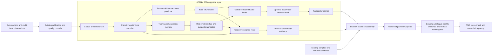

# Space JEPA 2: evidence audit and implementation plan

Date: 2026-09-19  
Status: design proposal; no Space JEPA 2 performance result exists yet  
Repository snapshot: `598da16` on `main`, clean working tree at audit start

Formal model specification:
[Space JEPA 2 hypercomplex mathematics and physics](SPACE_JEPA_2_HYPERCOMPLEX_PHYSICS_SPEC_2026-09-19.md).

Authoritative execution ledger:
[Space JEPA 2 final execution checklist](SPACE_JEPA_2_FINAL_EXECUTION_CHECKLIST_2026-09-19.md).

## Decision

Build Space JEPA 2 as a versioned upgrade of the existing SIDEREA transient
detection pipeline. Develop and validate the upgrade in an isolated path, but keep
the system identity explicit: **the product is the transient detection pipeline;
the APENic JEPA is its new predictive and anomaly-analysis engine.** It is not a
standalone foundation model or a replacement for the discovery workflow.

The upgraded engine is a **causal dual-route APENic predictive-memory JEPA**:

1. a predictive route forecasts future latent and observable evolution from only
   information available at a declared cutoff; and
2. an anomaly route preserves localized predictive surprise, representation
   novelty, memory support and route disagreement as separate evidence.

The useful APEN technology is training-only episodic residual retrieval, learned
support geometry, an explicit route gate and causal controls. These are first-class
APENic components of the upgraded detector and must be credited as such.
The historical APEN evidence is mostly negative or null, so memory is a hypothesis
that must earn its place through ablation. The current detector stages remain
independently inspectable baselines and safety paths until a frozen, common-cohort
experiment demonstrates that any stage can be replaced or skipped without
unacceptable loss of useful events.

The complete system boundary is:

> survey alerts and photometry -> calibration and quality control -> APENic JEPA
> prediction/anomaly routes -> candidate evidence fusion -> catalogue and identity
> checks -> fixed-budget review queue -> human reporting gate.

Space JEPA 2 succeeds only when this end-to-end pipeline finds or prioritizes useful
transients better at the same operational review budget. Latent prediction accuracy
alone is insufficient.

The initial paper direction is therefore:

> Does a causal dual-route predictive representation improve useful transient
> retrieval at a fixed review budget, preserve performance under a change in
> astronomical source population, and reduce expensive detector work without
> hiding failures or losing rare events?

That is a stronger and more testable claim than “a larger JEPA finds more objects.”

## What the repository establishes today

| Area | Implemented fact | Evidence boundary |
|---|---|---|
| Current TS-JEPA | An irregular-time Transformer masks a contiguous time region, predicts EMA-teacher latents, and supports elapsed-time or observation-count masks. | This is latent imputation. Because visible context may occur on both sides of the hidden block, it does not establish causal future forecasting. |
| Current representation | `extract_embeddings` mean-pools valid token representations into one vector per light curve. | Mean pooling can dilute or erase short localized events. No preserved token-level anomaly trace is routed into review. |
| Current anomaly route | `assemble_shadow_evidence` fits `RobustAnomalyDetector` on a disjoint reference embedding matrix and produces a rank-like score. | The anomaly detector is downstream from JEPA, not a learned second route inside the model. The score is explicitly not a probability. |
| Current integration | Heuristic, statistical template, JEPA novelty and random-audit routes remain separate in `build_integrated_shadow_queue`. Provenance and cutoff identities are checked. | There is deliberately no fused discovery probability and no learned route may authorize reporting. |
| Current JEPA evidence | The archived learning smoke run used three optimizer steps on tiny synthetic fixtures. Validation used five mask repeats and 20 target tokens. A later end-to-end smoke used one optimizer step, two repeats and eight target tokens. | These establish numerical execution, checkpointing and non-collapse diagnostics only. They do not establish astronomical utility, forecasting skill, anomaly recall or baseline superiority. |
| Real evaluation | The manuscript and `FINAL_TODO.md` state that heuristic, template, supervised baseline and JEPA have not been compared on one object-grouped chronological cohort. | No current artifact supports a claim that JEPA saves time, finds more transients or improves discovery yield. |
| Transient search | The statistical detector fits declared temporal templates and evaluates them under a simulated null with explicit limitations. | It remains sensitive to covariance, error misspecification and outliers. Archived failures must remain visible. |
| Operational gates | Candidate identity, evidence binding, immutable ledgers, catalogue checks, review and reporting preflight are implemented as separate contracts. | A model score cannot replace identity, catalogue, evidence or human-review requirements. |

### APEN evidence that constrains this design

The APEN repository was inspected as a related but separate source of mechanisms.
Its current research record does not support importing APEN as a proven superior
architecture:

- original APEN ranked behind simple and standard baselines in reduced Burgers,
  Navier–Stokes, partial-observation and viscosity-shift studies;
- a causal-control study found every tested memory/gate intervention changed mean
  error by less than the frozen `0.01` meaningful-effect threshold in that reduced
  regime;
- the APEN ablation record says memory and salience were not necessary for the
  observed small-protocol behavior; and
- the APEN-R residual study remains marked `RUNNING`, with 73 of 100 cells present,
  zero recorded failures and a dirty historical source snapshot. It has no final
  aggregate result and cannot be cited as a win.

APEN-R still contributes good experimental ideas: residual prediction around a
simple causal baseline, training-only memory, refreshed residual values, learned
distance, an explicit gate, group exclusion, and no-memory/frozen-metric/shuffled-
value controls. Space JEPA 2 should port those principles to irregular light curves.
It should not copy APEN-R's spatial convolution implementation, which assumes dense
periodic fields shaped `[batch, history, channel, space]` and does not match survey
photometry.

## Why a new path is warranted

The current model has four specific limitations that line up with the proposed
research question:

1. **The training task is not forward-only.** A masked target can have visible
   observations before and after it. That is useful for representation learning,
   but insufficient for claims about predicting what happens next.
2. **Mean pooling discards event location.** A brief rise, color change or isolated
   disagreement can disappear inside a curve-level average.
3. **Novelty and prediction are disconnected.** Representation distance is computed
   after embedding extraction, while the model does not explain whether novelty
   came from prediction failure, weak memory support, cadence, missing values or a
   genuinely unfamiliar morphology.
4. **There is no measured component substitution.** The current pipeline cannot
   truthfully say which detector work JEPA makes unnecessary because no common
   cohort has measured recall, yield, latency and failure modes under a fixed budget.

Space JEPA 2 should address these limitations without rewriting the current TS-JEPA
or its historical artifacts. The old path is a required baseline.

## Proposed architecture

### 1. Causal prefix construction

For each object and cutoff `t`, create one or more prefix/target examples:

- context contains observations with time `<= t` only;
- targets are one or more future windows at prespecified physical horizons;
- normalization is fitted from the permitted prefix only;
- object aliases, observation IDs and source groups remain inseparable across
  train, validation and test;
- non-detections stay explicit instead of being converted to zero-valued detections;
- band vocabulary, calibration, cadence, depth and cutoff identities are bound into
  the artifact contract.

This builder must support **prequential scoring**. When an observation at `t_j`
exists, the score for it is generated from the prefix ending before `t_j`. This
lets the system accumulate observed prediction errors without accessing the future.
Predictions beyond the latest observation remain forecasts and must be labelled as
unverified until later data arrive.

### 2. Shared irregular-time encoder

Reuse the well-tested token contract and the timing/band Transformer concepts from
`src/siderea/ml/jepa.py`, but instantiate them in a new versioned model. Do not
change the old checkpoint format. The encoder should return the full valid token
sequence and a designated causal summary token; it must not reduce the curve to a
mean vector before anomaly evidence is formed.

### 3. Predictive route

The base predictor maps a causal summary and requested physical horizon to a future
latent sequence. The primary JEPA loss compares predicted latents with the detached
EMA target encoder at future positions. Multi-horizon targets should include a short,
nominal and long physical interval chosen before evaluation.

An optional observation head maps predicted latents to a distribution over flux or
magnitude and detection state. It is an auxiliary head used to measure forecast
quality and render interpretable trajectories. It must report its likelihood family,
scale convention and missing/censored-data handling. A latent predictor alone should
not be called a physical world model.

### 4. APEN-derived residual memory

Memory contains training prefixes only. Each entry stores:

- a causal context key;
- the corresponding base-predictor latent residual at each horizon;
- object/source group and observation cutoff;
- survey, band and calibration contract; and
- the checkpoint and code identity that produced it.

At inference, a learned distance retrieves compatible training contexts. A gate
adds the weighted residual to the base future latent:

`z_corrected = z_base + sigmoid(g) * retrieved_residual`

Required invariants:

- validation and test objects never write to memory;
- a query object's aliases and source group are excluded from its retrieval pool;
- residual values are refreshed when the base checkpoint changes;
- incompatible survey/calibration contracts fail closed;
- memory capacity and eviction are deterministic and recorded;
- nearest-neighbor identities, distances, attention entropy and gate value remain
  inspectable; and
- no retrieved label or later outcome enters the predictor.

The base forecast and corrected forecast must both be retained. Otherwise memory can
“explain away” exactly the unusual event the anomaly route needs to surface.

### 5. Anomaly route

The anomaly route should output a vector of evidence rather than one opaque score:

| Signal | Meaning | Failure it helps expose |
|---|---|---|
| Prequential base surprise | Error when prior context predicts each newly observed token | Abrupt or structurally unexpected evolution |
| Corrected surprise | Error after memory correction | Whether retrieved precedents genuinely help |
| Memory support distance | Distance to compatible training contexts | Out-of-population context |
| Retrieval entropy | Concentrated versus diffuse memory support | Unstable or ambiguous analogy |
| Route disagreement | Difference between base and memory-corrected forecasts | Memory overreach or regime mismatch |
| Representation novelty | Robust score relative to a frozen training reference | Global morphology shift |
| Coverage/cadence diagnostics | Fraction observed, gaps, bands and depth | Artifact or weak-evidence explanation |

Every component stays in the evidence artifact. A scalar queue score may be derived
from training/validation data only, then frozen. It remains a rank, not a transient
probability. The review UI should show the temporal location of the highest surprise,
which observations contributed, and whether the signal is supported across bands.

### 6. Pipeline role

During development and prospective shadow evaluation, Space JEPA 2 runs alongside
all current paths. It may change only the shadow review queue.

The efficiency hypothesis should be evaluated counterfactually: record which
template fits or follow-up computations a proposed policy would have skipped, while
still running them for the study. Only after a frozen evaluation may a later policy
actually suppress expensive work. Catalogue checks, entity resolution, evidence
binding, reportability gates and human decisions are outside the substitution claim.

## Research hypotheses

All thresholds below are proposed defaults. They must be reviewed with the astronomy
owner and frozen before outcome access.

### Primary hypothesis

At the same eligible population, point-in-time information and review budget,
Space JEPA 2 increases useful-event yield over the strongest incumbent route. Report
precision at budget, recall at budget where ascertainable, average precision,
reviewer minutes and unique useful events. A positive result requires a prespecified
minimum useful effect and a clustered confidence interval that excludes no benefit.

### Mechanism hypothesis

The gated memory route reduces paired multi-horizon forecast loss by at least 5%
relative to the identical no-memory model, with a positive paired-bootstrap lower
bound, while shuffled-value and wrong-population memory fail to reproduce the gain.
If this gate fails, remove memory from the model name and final system.

### Population-shift hypothesis

A model trained on source population A retains useful ranking and forecast behavior
on a meaningfully different, frozen source population B better than the old TS-JEPA
and simple forecast baselines. Absolute performance and degradation must both be
reported; a favorable degradation ratio cannot rescue poor absolute performance.

### Intervention hypothesis

After a finite-duration, explicitly simulated or naturally justified perturbation,
the model predicts subsequent autonomous evolution better than matched simple and
neural baselines. Performance during forcing and after forcing must be separated.

### Efficiency hypothesis

A frozen Space JEPA 2 screening policy reduces expensive downstream detector calls
or CPU time while keeping the lower confidence bound on useful-event recall loss
above an accepted non-inferiority margin. A proposed starting target is at least 30%
fewer expensive calls with no more than a 2 percentage-point recall loss. These
numbers are provisional until event prevalence, review cost and sample size are
known.

## Professor and outreach guidance carried into the protocol

The recoverable correspondence supports only the following attributions:

- **Steven Dillmann:** use a “change in source population” as the primary astronomy
  distribution-shift test. After the source-population evaluator was described as
  implemented and frozen, his preserved response was “Sounds great!” The wider
  interpretation in this plan is ours.
- **Kyle Cranmer:** test mechanistic value with a finite-duration intervention,
  removal of the intervention, and evaluation of later autonomous evolution. This
  is the basis for the intervention experiment above.
- **Ashish Mahabal thread:** design around real survey filters, cadence and depth.
  This motivates survey-bound token and evaluation contracts.
- **Marco Pavone:** declined because of other commitments and supplied no method
  guidance. He should not be cited as influencing the architecture.
- **Grace Gao, Stefano Ermon, Ludwig Schmidt and Yann LeCun:** outreach topics are
  recoverable, but no substantive reply is preserved. No method should be attributed
  to them without a recoverable response.
- **Shri Kulkarni:** said he was no longer an expert in the relevant area and copied
  Mahabal. That is routing context, not an endorsement.

The protocol-level synthesis is: change the population, intervene on the process,
and respect the actual observing system. It should be presented as a synthesis, not
as a quotation from any one professor.

## Data and split contract

The first real study should freeze one survey/campaign rather than mix convenient
fixtures. Given the existing ALeRCE/ZTF path, that is the lowest-integration-cost
candidate, but the owner must freeze the final campaign, dates and rights before
intake.

Required partitions:

1. **Development train A:** earlier objects from declared source populations;
2. **Development validation A:** later, object-disjoint data for architecture and
   threshold selection;
3. **Frozen population-shift test B:** a different source population with no tuning;
4. **Frozen chronological test A-later:** later arrivals from the original population;
5. **Prospective shadow cohort:** every eligible arrival, including rejected and
   unreviewed objects, with matured outcomes and random-audit sampling.

The source-population split must be scientific rather than a random label split.
Possible definitions include event family, host/environment regime or survey/cadence
domain, but only one primary shift should be frozen. The full denominator, uncertain
outcomes and censoring must be retained.

Synthetic injections are useful for sensitivity surfaces, cadence degradation and
controlled interventions. They cannot serve as the primary proof of real discovery
yield.

## Required baselines

All methods receive the same point-in-time observations and are evaluated at the
same review budget:

1. existing SIDEREA heuristic priority;
2. current statistical template search;
3. current supervised logistic baseline;
4. robust anomaly score on engineered features;
5. current TS-JEPA mean-embedding anomaly route;
6. persistence, linear and quadratic extrapolation;
7. a parameter- and training-budget-matched GRU;
8. a causal Transformer forecaster without JEPA target learning;
9. Space JEPA 2 without memory; and
10. full Space JEPA 2.

A masked-reconstruction or published astronomy representation baseline should be
added only when its data contract can be matched faithfully. Citation-level analogy
is not a baseline.

## Prespecified ablations and adversarial controls

### Architecture controls

- no memory;
- fixed uniform memory metric;
- shuffled memory residual values;
- wrong-population memory;
- gate fixed closed, learned and fixed open;
- base predictor removed from the anomaly feature vector;
- representation-novelty component removed;
- mean pooling versus token-level surprise retention;
- single-horizon versus multihorizon prediction;
- causal future masking versus the current bidirectional contiguous-mask task; and
- shared encoder versus parameter-matched separate forecast/anomaly encoders.

### Astronomy/input controls

- remove band identity;
- remove prior non-detections;
- degrade cadence;
- shift limiting depth and error calibration;
- drop one sensor/band at a time;
- corrupt a bounded fraction of errors or timestamps;
- insert isolated outliers and correlated-noise segments; and
- place events near observing-window edges and between template-grid locations.

### Leakage attacks

- same physical source under another alias;
- later observations accidentally present in prefix normalization;
- test object retrieved from memory;
- outcome label encoded in metadata;
- train/test overlap through reference embeddings; and
- future survey/calibration version reused under a past cutoff.

Every leakage attack should fail a test or verifier, not merely appear in a checklist.

## Metrics and uncertainty

### Forecast route

- horizon-specific latent Smooth-L1 loss;
- observable MAE/MSE or negative log likelihood under the declared head;
- interval coverage and sharpness when uncertainty is modeled;
- error before and after memory correction;
- paired error by object, population, cadence and event phase; and
- performance during intervention and after intervention removal.

### Anomaly and discovery route

- precision, recall and useful-event yield at fixed review budget;
- average precision where label coverage permits it;
- unique useful yield by route;
- route overlap/Jaccard matrix;
- artifact and known-variable fraction;
- time from first eligible evidence to queue entry; and
- false negatives found through the random-audit reserve.

### Operational route

- wall time and CPU time per object;
- peak memory;
- number and fraction of template fits avoided by the counterfactual policy;
- reviewer minutes per useful event;
- failure, unevaluated and insufficient-coverage counts; and
- result stability across replay.

Bootstrap and confidence intervals must use the scientific dependence unit chosen
before evaluation, likely object clustered within night or time block. Repeated masks
measure conditional mask variation only and must not be reported as population
generalization uncertainty.

## Promotion gates

| Gate | Required evidence | Failure action |
|---|---|---|
| G0: design freeze | Versioned protocol, source populations, horizons, baselines, seeds, budgets, outcomes, minimum effects, failure policy and hashes. | Do not inspect test outcomes. |
| G1: software validity | Unit/property tests, deterministic replay, cutoff and alias leakage attacks, memory exclusion, checkpoint compatibility, atomic artifacts and a complete smoke campaign. | Repair under a new source identity; preserve failed artifacts. |
| G2: mechanism | Full development grid; memory beats no-memory by the frozen useful effect and randomized controls fail; base forecast is competitive with simple baselines. | Remove or redesign memory under a new protocol. Do not tune on frozen test B. |
| G3: source-population shift | Frozen A-to-B test, absolute and relative metrics, cadence/depth slices and no hidden refit. | Report the negative result and keep the model experimental. |
| G4: common-cohort value | Object-grouped chronological comparison at a fixed review budget with uncertainty and adverse cases. | Retain the strongest simpler route. |
| G5: shadow efficiency | Prospective full denominator, random audit, mature outcomes and non-inferiority result for the counterfactual skip policy. | Continue running all detector paths. |
| G6: operational promotion | Independent scientific review of cohort, labels, leakage, failures and exact artifacts. | Space JEPA 2 remains shadow-only. |

Passing G1 means the software works. Passing G2 means a proposed mechanism survived
development. Neither is evidence of astronomical discovery improvement. Only G4/G5
can support the main operational claim.

## Implementation plan

Keep the old TS-JEPA baseline and checkpoint loader untouched. Add versioned modules
and artifacts so comparisons cannot silently change the incumbent.

### Work package 1: protocol and schemas

Add:

- `docs/SPACE_JEPA_2_PROTOCOL.md`
- `configs/space-jepa-2-development.toml`
- `src/siderea/research/space_jepa_v2_protocol.py`
- JSON schemas/constants for training, memory bank, inference evidence, benchmark and
  promotion decision artifacts.

The protocol validator must reject missing population definitions, overlapping
entities, unfrozen horizons, absent minimum effects and mutable output paths.

### Work package 2: causal data path

Add `src/siderea/ml/prequential.py` with prefix/target construction, prefix-only
normalization, physical-horizon sampling and group/cutoff validation. Extend the
dataset metadata contract rather than mutating `siderea.light_curve_tokens.v3`.
Tests should prove invariance to future-value changes and rejection of later input.

### Work package 3: model core

Add:

- `src/siderea/ml/space_jepa_v2.py` for the shared encoder, EMA target, multihorizon
  latent predictor and optional observation head;
- `src/siderea/ml/episodic_memory.py` for training-only residual retrieval; and
- `src/siderea/ml/space_jepa_v2_train.py` for deterministic training, selection and
  checkpointing.

Checkpoint metadata must bind the base model, target schedule, token/prefix contract,
memory contract, source identity, training cutoff and population definition.

### Work package 4: evidence-preserving inference

Add `src/siderea/ml/space_jepa_v2_evaluate.py`. Its artifact should retain per-object
and per-token:

- base and corrected predictions;
- target availability status;
- surprise components;
- memory neighbors/support/entropy;
- gate value;
- representation diagnostics;
- cadence, bands and coverage; and
- all relevant dataset/checkpoint/code digests.

Curve-level summary fields must be derived from these retained rows. Do not discard
the temporal evidence after forming a queue score.

### Work package 5: shadow integration

Add new CLI commands instead of changing existing command semantics:

- `space-jepa-2-train`
- `space-jepa-2-infer`
- `space-jepa-2-benchmark`
- `space-jepa-2-shadow-assemble`

Extend `src/siderea/research/pilot.py` through a new v2 schema that binds the current
pipeline and template artifacts to the new multi-component evidence. The v1 pilot
must continue to replay exactly. The queue should expose distinct selection routes
for predictive surprise, memory unsupportedness and representation novelty before
any combined policy is tested.

### Work package 6: benchmark runner

Add `src/siderea/research/space_jepa_v2_benchmark.py` and a resumable runner that:

- trains/refits only on permitted data per fold;
- records every model/seed/population/horizon cell;
- never silently retries or removes a failed cell;
- writes atomic manifests and source/config/data hashes;
- computes paired and clustered intervals only after completeness checks; and
- produces tables directly from retained row-level results.

The existing `run_rolling_origin_benchmark` evaluates fixed precomputed scores. It
cannot by itself satisfy this requirement because Space JEPA 2 needs fold-local
training and memory construction.

### Work package 7: review rendering

Add a shadow-only review panel showing observed points, base/corrected forecasts,
token-level surprise, retrieved analogues and coverage warnings. Retrieval examples
must obey cutoff and identity contracts. No new panel state may satisfy a reporting
gate.

## Execution order

1. Freeze `SPACE_JEPA_2_PROTOCOL.md` and the data/split manifest.
2. Implement causal prefixes and leakage tests.
3. Implement the no-memory predictive JEPA and compare it with persistence, linear,
   quadratic, GRU and causal Transformer controls.
4. Add APEN-derived memory only after the no-memory forecast path is valid.
5. Run the complete mechanism grid on development data and apply G2.
6. Freeze the chosen scalar queue policy, if any, without accessing test B.
7. Run source-population shift and chronological held-out tests once.
8. Integrate a complete counterfactual shadow campaign in SIDEREA.
9. Promote component skipping only after G5 and independent G6 review.

The first build milestone should end after step 3. This prevents memory complexity
from masking whether causal JEPA forecasting itself works.

## Stop rules

Stop or simplify the branch when any of the following occurs:

- causal JEPA does not beat simple extrapolation or matched causal Transformer on
  the frozen development criterion;
- memory does not beat no-memory or its gain survives shuffled-value controls;
- gains appear only under random splits and vanish under chronological grouping;
- population-shift performance is poor in absolute terms despite a favorable ratio;
- the scalar anomaly score improves synthetic injections but harms audited real
  recall at the review budget;
- efficiency comes from skipping cases whose outcomes are unknown; or
- the result depends on changing source populations, horizons, thresholds, seeds or
  baseline budgets after test inspection.

A negative result is still valuable: it can show that token-level causal surprise,
current template statistics or a simpler forecaster is the stronger route.

## Naming and attribution

“Space JEPA 2” is a useful working name. A descriptive paper name would be
**Dual-Route Predictive-Memory JEPA for Irregular Astronomical Time Series**. If
memory fails G2, use **Causal Dual-Route JEPA** and remove APEN from the mechanism
claim. If only token-level surprise succeeds, name the method for that contribution.

Any final paper should say that the residual-memory route is derived from the APEN-R
design study and then state the APEN negative/null evidence. Hiding that lineage
would weaken provenance, novelty review and the credibility of the ablations.

## Immediate definition of done

Planning is complete when this document is reviewed. Implementation should begin
only from a separate, versioned protocol whose hashes predate development outcomes.
The first executable delivery is complete when:

- causal prefix fixtures and future-leakage tests pass;
- the no-memory Space JEPA 2 checkpoint trains and replays deterministically;
- base forecasts and token-level surprise are emitted in a provenance-bound artifact;
- all six simple/neural baselines run on the same development cells;
- the old TS-JEPA smoke and v1 shadow pilot remain unchanged; and
- the result is labelled development evidence regardless of direction.
